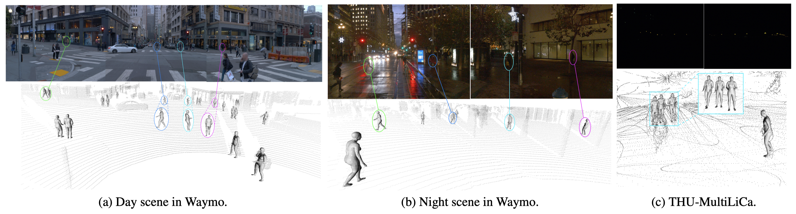
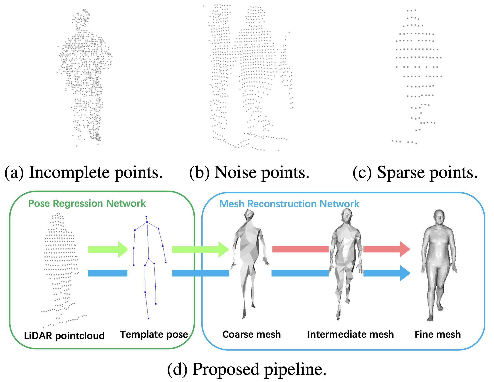
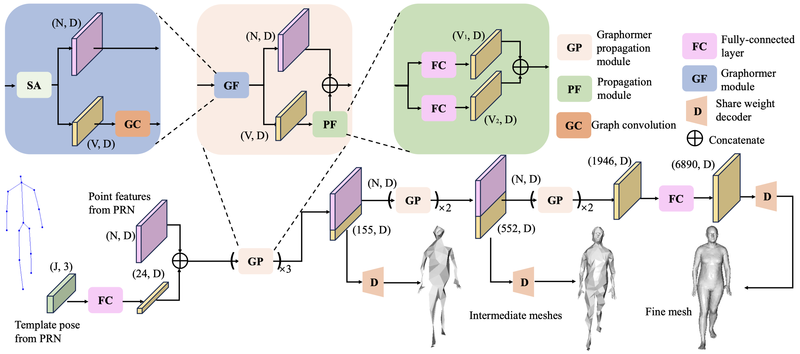
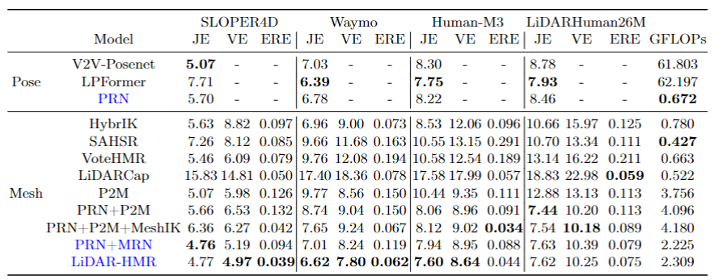
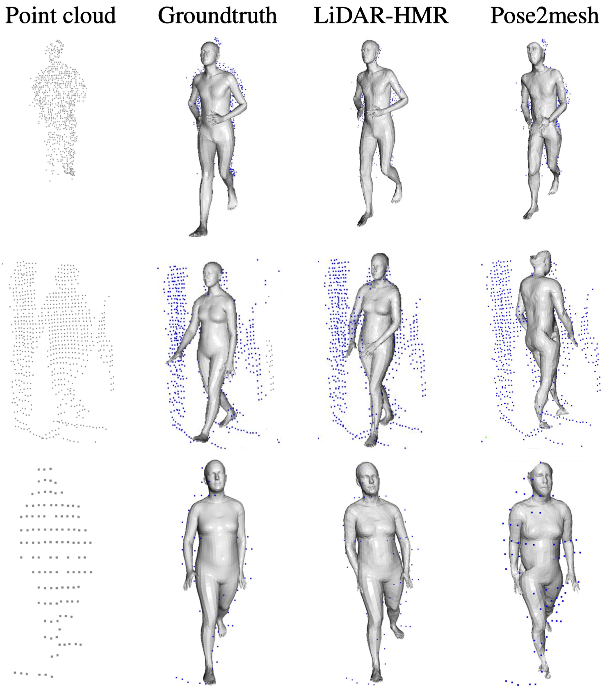

# LiDAR-HMR: 3D Human Mesh Recovery from LiDAR

### [Paper](https://arxiv.org/pdf/2311.11971) 

> LiDAR-HMR: 3D Human Mesh Recovery from LiDAR

> [Bohao Fan](https://github.com/soullessrobot)*, [Wenzhao Zheng](https://wzzheng.net/), [Jianjiang Feng](http://ivg.au.tsinghua.edu.cn/~jfeng/), [Jie Zhou](https://scholar.google.com/citations?user=6a79aPwAAAAJ&hl=en&authuser=1)

## Demo



## Introduction

In recent years, point cloud perception tasks have been garnering increasing attention. This paper presents the first attempt to estimate 3D human body mesh from sparse LiDAR point clouds. We found that the major challenge in estimating human pose and mesh from point clouds lies in the sparsity, noise, and incompletion of LiDAR point clouds. Facing these challenges, we propose an effective sparse-to-dense reconstruction scheme to reconstruct 3D human mesh. This involves estimating a sparse representation of a human (3D human pose) and gradually reconstructing the body mesh. To better leverage the 3D structural information of point clouds, we employ a cascaded graph transformer (graphormer) to introduce point cloud features during sparse-to-dense reconstruction. Experimental results on three publicly available databases demonstrate the effectiveness of the proposed approach.

### Challenges & Our pipeline



### Framework



### Results



### More Visualizations



## Code
Preparation:
Downloading the SMPL-X model weights from [this website](https://smpl-x.is.tue.mpg.de/) into 'smplx_models' folder.

Installation:
```
pip install -r requirements.txt
```
Install the [Point Transformer-V2](https://github.com/Pointcept/PointTransformerV2) and [ChamferDistancePytorch](https://github.com/ThibaultGROUEIX/ChamferDistancePytorch) following their official documents.

Code:
We have implemented or modified several 3D HPE works based on point cloud including:

V2V-PoseNet: https://arxiv.org/abs/1711.07399

LPFormer: https://arxiv.org/abs/2306.12525

HybrIK: https://arxiv.org/abs/2011.14672

SAHSR: https://openaccess.thecvf.com/content_ICCV_2019/html/Jiang_Skeleton-Aware_3D_Human_Shape_Reconstruction_From_Point_Clouds_ICCV_2019_paper.html

VoteHMR: https://arxiv.org/abs/2110.08729

LiDARCap: https://arxiv.org/abs/2203.14698

Pose2Mesh: https://arxiv.org/abs/2008.09047

The corresponding train and test codes are in the 'scripts' folder.

Training:
Edit the corresponding path and variable in the training files.
PRN training:
```
python scripts/pct/train_pct.py --dataset sloper4d --cfg configs/pose/pose_15.yaml
```
LiDAR_HMR training:
```
python scripts/lidar_hmr/train_lidarhmr.py --dataset sloper4d --cfg configs/mesh/sloper4d.yaml --prn_state_dict /path/to/your/file
```
LiDAR_HMR testing:
```
python scripts/lidar_hmr/test_lidarhmr.py --dataset sloper4d --cfg configs/mesh/sloper4d.yaml --state_dict /path/to/your/file
```
## Pretrained Models
[Download link](https://cloud.tsinghua.edu.cn/d/bd9ce4827f164591893d/)
## Related Projects

Our code is based on [Mesh Graphormer](https://arxiv.org/abs/2104.00272), [Point Transformer-V2](https://github.com/Pointcept/PointTransformerV2), and [HybrIK](https://arxiv.org/abs/2011.14672).

## Citation

If you find this project helpful, please consider citing the following paper:
```
@article{fan2023lidar,
    title={LiDAR-HMR: 3D Human Mesh Recovery from LiDAR},
    author={Fan, Bohao and Zheng, Wenzhao and Feng, Jianjiang and Zhou, Jie},
    journal={arXiv preprint arXiv:2311.11971},
    year={2023}
}
```
